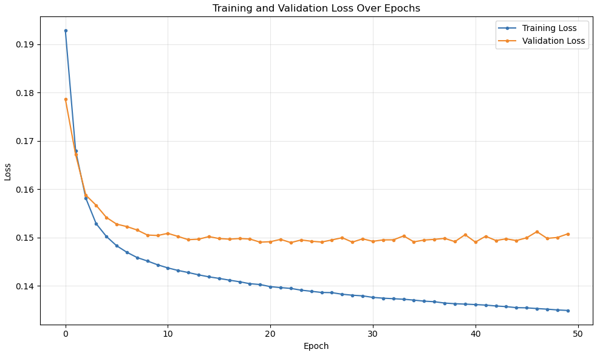
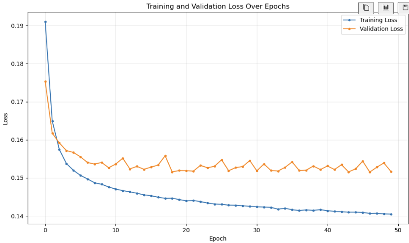
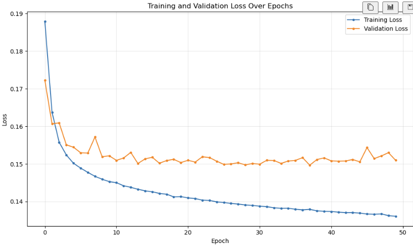
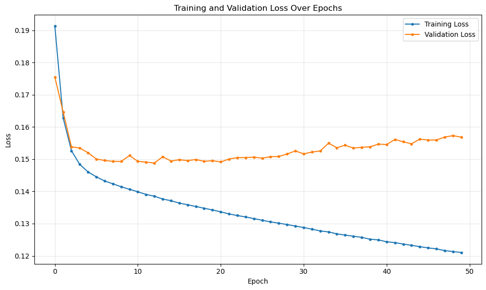
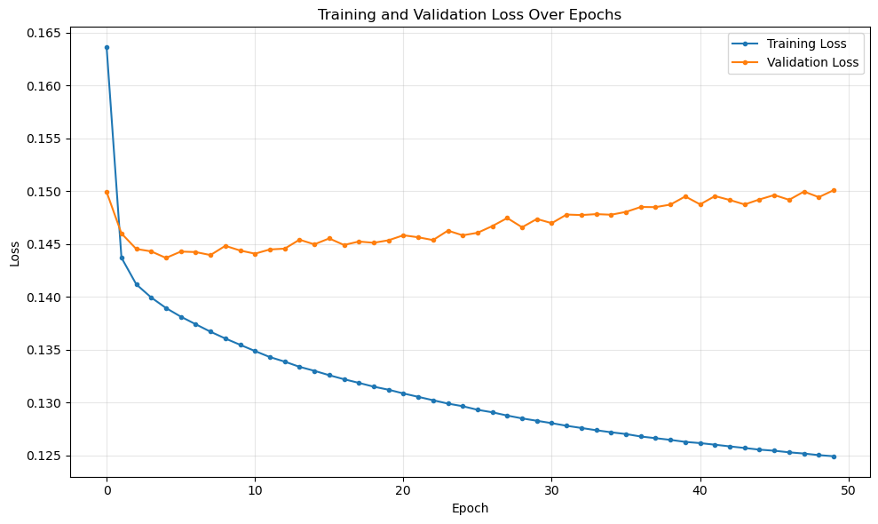
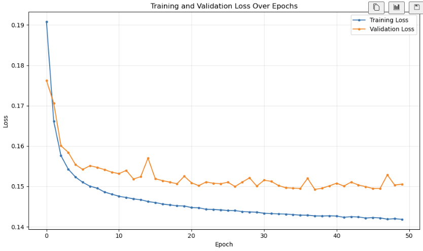

## Wide Model:
**Attempt 1:**  
hidden_layers=[256, 128], dropout_rate=0.0 lr=0.001 
Train Sample
======================================================
Epoch [5/50] | Train Loss: 0.1502 | Val Loss: 0.1542 | Val MAE: 0.2525 | Val R2: 0.5752
Epoch [10/50] | Train Loss: 0.1443 | Val Loss: 0.1504 | Val MAE: 0.2489 | Val R2: 0.5855
Epoch [15/50] | Train Loss: 0.1419 | Val Loss: 0.1502 | Val MAE: 0.2487 | Val R2: 0.5862
Epoch [20/50] | Train Loss: 0.1403 | Val Loss: 0.1490 | Val MAE: 0.2480 | Val R2: 0.5894
Epoch [25/50] | Train Loss: 0.1389 | Val Loss: 0.1492 | Val MAE: 0.2494 | Val R2: 0.5888
Epoch [30/50] | Train Loss: 0.1379 | Val Loss: 0.1497 | Val MAE: 0.2483 | Val R2: 0.5875
Epoch [35/50] | Train Loss: 0.1370 | Val Loss: 0.1491 | Val MAE: 0.2468 | Val R2: 0.5891
Epoch [40/50] | Train Loss: 0.1362 | Val Loss: 0.1506 | Val MAE: 0.2476 | Val R2: 0.5851
Epoch [45/50] | Train Loss: 0.1355 | Val Loss: 0.1494 | Val MAE: 0.2468 | Val R2: 0.5884
Epoch [50/50] | Train Loss: 0.1349 | Val Loss: 0.1507 | Val MAE: 0.2497 | Val R2: 0.5846

**Attempt 2:**  
hidden_layers=[256, 128], dropout_rate=0.0 lr=0.005  
Train Sample
======================================================
Epoch [5/50] | Train Loss: 0.1520 | Val Loss: 0.1567 | Val MAE: 0.2643 | Val R2: 0.5683  
Epoch [10/50] | Train Loss: 0.1476 | Val Loss: 0.1526 | Val MAE: 0.2496 | Val R2: 0.5794  
Epoch [15/50] | Train Loss: 0.1455 | Val Loss: 0.1522 | Val MAE: 0.2479 | Val R2: 0.5805  
Epoch [20/50] | Train Loss: 0.1443 | Val Loss: 0.1519 | Val MAE: 0.2515 | Val R2: 0.5814  
Epoch [25/50] | Train Loss: 0.1431 | Val Loss: 0.1530 | Val MAE: 0.2609 | Val R2: 0.5784  
Epoch [30/50] | Train Loss: 0.1425 | Val Loss: 0.1545 | Val MAE: 0.2486 | Val R2: 0.5742  
Epoch [35/50] | Train Loss: 0.1420 | Val Loss: 0.1527 | Val MAE: 0.2491 | Val R2: 0.5791  
Epoch [40/50] | Train Loss: 0.1416 | Val Loss: 0.1522 | Val MAE: 0.2587 | Val R2: 0.5807  
Epoch [45/50] | Train Loss: 0.1410 | Val Loss: 0.1524 | Val MAE: 0.2484 | Val R2: 0.5801  
Epoch [50/50] | Train Loss: 0.1405 | Val Loss: 0.1517 | Val MAE: 0.2499 | Val R2: 0.5821  
  

**Attempt 3:**  
hidden_layers=[256, 128, 64], dropout_rate=0.0 lr=0.005
Train Sample
======================================================
Epoch [5/50] | Train Loss: 0.1502 | Val Loss: 0.1545 | Val MAE: 0.2535 | Val R2: 0.5744  
Epoch [10/50] | Train Loss: 0.1453 | Val Loss: 0.1522 | Val MAE: 0.2465 | Val R2: 0.5808  
Epoch [15/50] | Train Loss: 0.1429 | Val Loss: 0.1513 | Val MAE: 0.2507 | Val R2: 0.5830  
Epoch [20/50] | Train Loss: 0.1413 | Val Loss: 0.1504 | Val MAE: 0.2477 | Val R2: 0.5857  
Epoch [25/50] | Train Loss: 0.1399 | Val Loss: 0.1507 | Val MAE: 0.2495 | Val R2: 0.5847  
Epoch [30/50] | Train Loss: 0.1390 | Val Loss: 0.1501 | Val MAE: 0.2456 | Val R2: 0.5864  
Epoch [35/50] | Train Loss: 0.1382 | Val Loss: 0.1508 | Val MAE: 0.2440 | Val R2: 0.5847  
Epoch [40/50] | Train Loss: 0.1374 | Val Loss: 0.1516 | Val MAE: 0.2544 | Val R2: 0.5823  
Epoch [45/50] | Train Loss: 0.1369 | Val Loss: 0.1505 | Val MAE: 0.2486 | Val R2: 0.5852  
Epoch [50/50] | Train Loss: 0.1361 | Val Loss: 0.1510 | Val MAE: 0.2445 | Val R2: 0.5841  

**Attempt 4:**   
hidden_layers=[512, 246, 128], dropout_rate=0.0 lr=0.001
Train Sample
======================================================
--- Training BikeDemandNet ---
Epoch [5/50] | Train Loss: 0.1461 | Val Loss: 0.1520 | Val MAE: 0.2569 | Val R2: 0.5811  
Epoch [10/50] | Train Loss: 0.1406 | Val Loss: 0.1511 | Val MAE: 0.2529 | Val R2: 0.5835  
Epoch [15/50] | Train Loss: 0.1371 | Val Loss: 0.1494 | Val MAE: 0.2446 | Val R2: 0.5883  
Epoch [20/50] | Train Loss: 0.1342 | Val Loss: 0.1496 | Val MAE: 0.2505 | Val R2: 0.5879  
Epoch [25/50] | Train Loss: 0.1316 | Val Loss: 0.1506 | Val MAE: 0.2448 | Val R2: 0.5850  
Epoch [30/50] | Train Loss: 0.1292 | Val Loss: 0.1526 | Val MAE: 0.2440 | Val R2: 0.5797  
Epoch [35/50] | Train Loss: 0.1268 | Val Loss: 0.1536 | Val MAE: 0.2496 | Val R2: 0.5770  
Epoch [40/50] | Train Loss: 0.1249 | Val Loss: 0.1547 | Val MAE: 0.2489 | Val R2: 0.5739  
Epoch [45/50] | Train Loss: 0.1229 | Val Loss: 0.1562 | Val MAE: 0.2509 | Val R2: 0.5697  
Epoch [50/50] | Train Loss: 0.1210 | Val Loss: 0.1568 | Val MAE: 0.2458 | Val R2: 0.5680  

**Attempt 5:** 
hidden_layers=[512, 246, 128, 64], dropout_rate=0.0 lr=0.001
Train Sample
======================================================
Epoch [5/50] | Train Loss: 0.1460 | Val Loss: 0.1510 | Val MAE: 0.2499 | Val R2: 0.5838
Epoch [10/50] | Train Loss: 0.1402 | Val Loss: 0.1493 | Val MAE: 0.2430 | Val R2: 0.5887
Epoch [15/50] | Train Loss: 0.1364 | Val Loss: 0.1493 | Val MAE: 0.2477 | Val R2: 0.5886
Epoch [20/50] | Train Loss: 0.1333 | Val Loss: 0.1497 | Val MAE: 0.2439 | Val R2: 0.5876
Epoch [25/50] | Train Loss: 0.1304 | Val Loss: 0.1511 | Val MAE: 0.2457 | Val R2: 0.5836
Epoch [30/50] | Train Loss: 0.1276 | Val Loss: 0.1516 | Val MAE: 0.2435 | Val R2: 0.5823
Epoch [35/50] | Train Loss: 0.1251 | Val Loss: 0.1555 | Val MAE: 0.2455 | Val R2: 0.5716
Epoch [40/50] | Train Loss: 0.1229 | Val Loss: 0.1546 | Val MAE: 0.2446 | Val R2: 0.5740
Epoch [45/50] | Train Loss: 0.1207 | Val Loss: 0.1572 | Val MAE: 0.2470 | Val R2: 0.5671
Epoch [50/50] | Train Loss: 0.1185 | Val Loss: 0.1588 | Val MAE: 0.2485 | Val R2: 0.5625

**Attempt 6: hidden_layers=[512, 246, 128, 64], dropout_rate=0.0 lr=0.001**  
Full Training Set -- Ended Early
======================================================
Epoch [5/50] | Train Loss: 0.1385 | Val Loss: 0.1439 | Val MAE: 0.2421 | Val R2: 0.6034
Epoch [10/50] | Train Loss: 0.1346 | Val Loss: 0.1440 | Val MAE: 0.2374 | Val R2: 0.6033
Epoch [15/50] | Train Loss: 0.1319 | Val Loss: 0.1455 | Val MAE: 0.2392 | Val R2: 0.5992
Epoch [20/50] | Train Loss: 0.1296 | Val Loss: 0.1477 | Val MAE: 0.2418 | Val R2: 0.5933
Epoch [25/50] | Train Loss: 0.1278 | Val Loss: 0.1485 | Val MAE: 0.2428 | Val R2: 0.5910
Epoch [30/50] | Train Loss: 0.1265 | Val Loss: 0.1489 | Val MAE: 0.2410 | Val R2: 0.5900

**Attempt 7: hidden_layers=[512, 246, 128], dropout_rate=0.0 lr=0.001**  
Full Training Set -- 190 minute training time
======================================================
Epoch [5/50] | Train Loss: 0.1389 | Val Loss: 0.1437 | Val MAE: 0.2430 | Val R2: 0.6041
Epoch [10/50] | Train Loss: 0.1355 | Val Loss: 0.1444 | Val MAE: 0.2435 | Val R2: 0.6023
Epoch [15/50] | Train Loss: 0.1330 | Val Loss: 0.1450 | Val MAE: 0.2412 | Val R2: 0.6007
Epoch [20/50] | Train Loss: 0.1312 | Val Loss: 0.1453 | Val MAE: 0.2411 | Val R2: 0.5998
Epoch [25/50] | Train Loss: 0.1296 | Val Loss: 0.1458 | Val MAE: 0.2405 | Val R2: 0.5985
Epoch [30/50] | Train Loss: 0.1283 | Val Loss: 0.1474 | Val MAE: 0.2404 | Val R2: 0.5942
Epoch [35/50] | Train Loss: 0.1272 | Val Loss: 0.1478 | Val MAE: 0.2407 | Val R2: 0.5931
Epoch [40/50] | Train Loss: 0.1263 | Val Loss: 0.1495 | Val MAE: 0.2419 | Val R2: 0.5882
Epoch [45/50] | Train Loss: 0.1255 | Val Loss: 0.1492 | Val MAE: 0.2410 | Val R2: 0.5891
Epoch [50/50] | Train Loss: 0.1249 | Val Loss: 0.1501 | Val MAE: 0.2406 | Val R2: 0.5867

## Deep Model:
**Attempt 1: hidden_layers=[128, 64, 32], dropout_rate=0.0**
======================================================
Epoch [5/50] | Train Loss: 0.1523 | Val Loss: 0.1554 | Val MAE: 0.2520 | Val R2: 0.5718  
Epoch [10/50] | Train Loss: 0.1481 | Val Loss: 0.1535 | Val MAE: 0.2488 | Val R2: 0.5771  
Epoch [15/50] | Train Loss: 0.1462 | Val Loss: 0.1570 | Val MAE: 0.2602 | Val R2: 0.5673  
Epoch [20/50] | Train Loss: 0.1451 | Val Loss: 0.1525 | Val MAE: 0.2472 | Val R2: 0.5799  
Epoch [25/50] | Train Loss: 0.1442 | Val Loss: 0.1506 | Val MAE: 0.2486 | Val R2: 0.5850  
Epoch [30/50] | Train Loss: 0.1436 | Val Loss: 0.1500 | Val MAE: 0.2522 | Val R2: 0.5865  
Epoch [35/50] | Train Loss: 0.1430 | Val Loss: 0.1496 | Val MAE: 0.2490 | Val R2: 0.5879  
Epoch [40/50] | Train Loss: 0.1427 | Val Loss: 0.1501 | Val MAE: 0.2481 | Val R2: 0.5864  
Epoch [45/50] | Train Loss: 0.1421 | Val Loss: 0.1499 | Val MAE: 0.2474 | Val R2: 0.5869  
Epoch [50/50] | Train Loss: 0.1418 | Val Loss: 0.1505 | Val MAE: 0.2535 | Val R2: 0.5852  
  